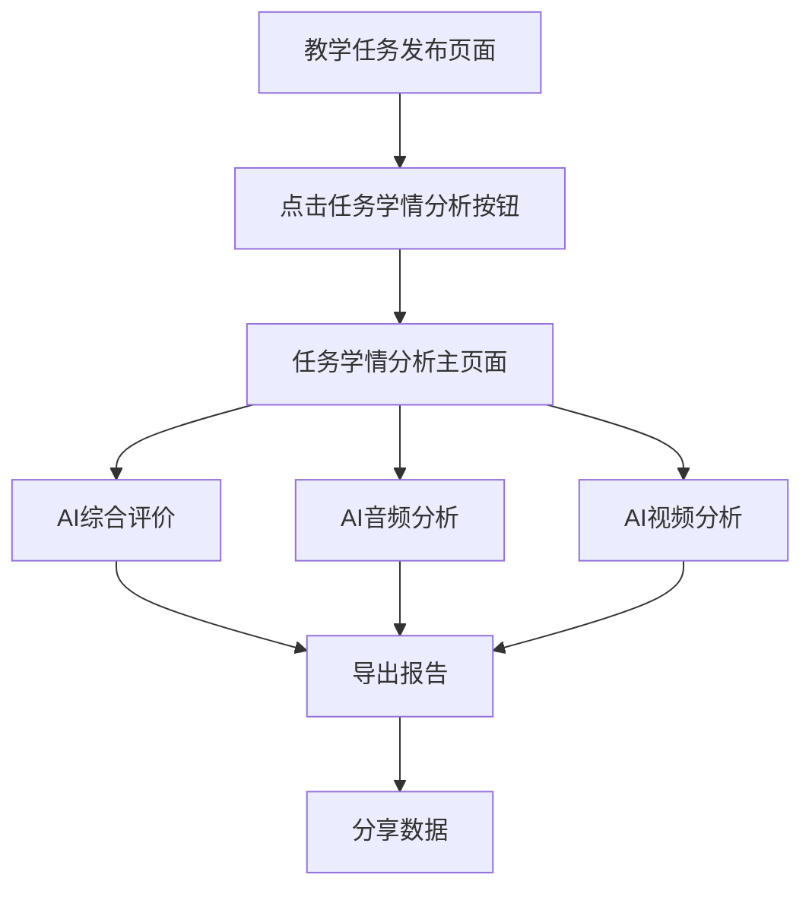

# 教学任务学情分析功能需求文档

## 1. 产品概述

本功能为未来教师实习实训系统新增的教学任务学情分析模块，旨在为教师和管理员提供基于AI技术的任务整体评价分析。通过对师范生在教学任务中的表现进行多维度数据统计和智能分析，帮助了解整个任务的完成情况、学生表现水平分布以及教学效果评估。

该功能将从个体学情分析数据中聚合统计，生成任务级别的综合分析报告，为教学质量改进和课程优化提供数据支撑。

## 2. 核心功能

### 2.1 用户角色

| 角色  | 访问权限        | 核心功能                 |
| --- | ----------- | -------------------- |
| 教师  | 查看自己发布的任务分析 | 查看任务学情分析、导出报告、分享数据   |
| 管理员 | 查看所有任务分析    | 查看所有任务学情分析、系统管理、数据统计 |

### 2.2 功能模块

本功能包含以下主要页面：

1. **任务发布页面**：在现有教学任务发布div中添加"任务学情分析"按钮
2. **任务学情分析主页面**：包含三个标签页的综合分析界面
3. **AI综合评价页面**：任务整体评价数据统计和分析
4. **AI音频分析页面**：任务中所有师范生音频数据的客观统计
5. **AI视频分析页面**：任务中所有师范生视频数据的客观统计

### 2.3 页面详情

| 页面名称      | 模块名称     | 功能描述                                |
| --------- | -------- | ----------------------------------- |
| 任务发布页面    | 学情分析按钮   | 在教学任务发布div中添加"任务学情分析"按钮，点击进入分析页面    |
| 任务学情分析主页面 | 页面头部     | 显示任务基本信息（任务名称、发布时间、参与人数、任务状态等）      |
| 任务学情分析主页面 | 标签页导航    | 三个标签页：AI综合评价、AI音频分析、AI视频分析，默认进入综合评价 |
| AI综合评价页面  | 核心指标卡片   | 显示平均得分、任务完成进度、优秀率、及格率四个关键指标         |
| AI综合评价页面  | 综合评价概览   | 六个维度的雷达图，对比师范生平均成绩与历史任务评价           |
| AI综合评价页面  | 师范生成绩排行  | 前十名师范生的横向柱状图，按得分从高到低显示              |
| AI综合评价页面  | 成绩分布图    | 任务中所有师范生成绩的正态分布图                    |
| AI综合评价页面  | 详细评价分析   | 六个维度的文字分析，描述整个任务师范生在各维度的表现          |
| AI综合评价页面  | AI智能分析报告 | 基于任务整体数据的AI分析报告和改进建议                |
| AI音频分析页面  | 音频指标统计   | 普通话、语速、音量、关键词、口头禅、提问等客观数据统计         |
| AI音频分析页面  | 数据分布图表   | 各项音频指标的分布图表和趋势分析                    |
| AI音频分析页面  | AI智能分析报告 | 基于音频数据的整体分析报告                       |
| AI视频分析页面  | 视频指标统计   | 教学姿态、面部表情、板书分析、课堂互动等客观数据统计          |
| AI视频分析页面  | 数据分布图表   | 各项视频指标的分布图表和趋势分析                    |
| AI视频分析页面  | AI智能分析报告 | 基于视频数据的整体分析报告                       |

## 3. 核心流程

### 3.1 主要操作流程

**教师操作流程：**

1. 教师在教学任务发布页面点击"任务学情分析"按钮
2. 系统跳转到任务学情分析页面，默认显示AI综合评价标签页
3. 教师可以切换到AI音频分析或AI视频分析标签页查看详细数据
4. 教师可以导出分析报告或分享分析结果
5. 教师可以返回任务发布页面

**数据流程：**

1. 系统从各个师范生的个体学情分析数据中聚合统计
2. 计算任务级别的平均值、分布情况、排名等统计指标
3. 生成AI分析报告和改进建议
4. 实时更新数据展示



## 4. 用户界面设计

### 4.1 设计风格

* **主色调**：#409eff（主蓝色）、#67c23a（成功绿色）

* **辅助色**：#e6a23c（警告橙色）、#f56c6c（危险红色）

* **按钮样式**：圆角按钮，支持悬停效果

* **字体**：系统默认字体，标题16-28px，正文14-16px

* **布局风格**：卡片式布局，玻璃态效果（glass-card）

* **图标风格**：Element Plus图标库，线性风格

### 4.2 页面设计概览

| 页面名称      | 模块名称     | UI元素                      |
| --------- | -------- | ------------------------- |
| 任务发布页面    | 学情分析按钮   | 蓝色主要按钮，带图标，位于任务操作区域       |
| 任务学情分析主页面 | 页面头部     | 渐变背景，任务信息标签，操作按钮组         |
| 任务学情分析主页面 | 标签页导航    | Element Plus标签页组件，三个标签页   |
| AI综合评价页面  | 核心指标卡片   | 4个横向排列的玻璃态卡片，包含图标、数值、单位   |
| AI综合评价页面  | 综合评价概览   | 雷达图居左，维度列表居右，玻璃态卡片容器      |
| AI综合评价页面  | 师范生成绩排行  | 横向柱状图，显示前10名，带头像和姓名       |
| AI综合评价页面  | 成绩分布图    | 正态分布曲线图，带统计信息             |
| AI综合评价页面  | 详细评价分析   | 6个维度的卡片式布局，每个卡片包含标题和分析文字  |
| AI综合评价页面  | AI智能分析报告 | 大卡片布局，包含AI图标、总结文字和分维度分析   |
| AI音频分析页面  | 音频指标统计   | 6个指标卡片，网格布局，显示平均值和分布情况    |
| AI音频分析页面  | 数据分布图表   | 多种图表类型（柱状图、折线图、散点图）展示数据分布 |
| AI视频分析页面  | 视频指标统计   | 4个主要指标卡片，显示统计数据和分布情况      |
| AI视频分析页面  | 数据分布图表   | 饼图、柱状图等展示视频分析数据分布         |

### 4.3 响应式设计

* **桌面优先**：主要针对1920x1080分辨率设计

* **移动适配**：支持平板和手机端访问，采用响应式布局

* **触摸优化**：按钮和交互元素支持触摸操作

## 5. 数据结构设计

### 5.1 任务基本信息

```typescript
interface TaskInfo {
  taskId: string          // 任务ID
  taskName: string        // 任务名称
  publishTime: string     // 发布时间
  deadline: string        // 截止时间
  participantCount: number // 参与人数
  completedCount: number  // 完成人数
  status: 'active' | 'completed' | 'expired' // 任务状态
  description: string     // 任务描述
}
```

### 5.2 AI综合评价数据

```typescript
interface TaskEvaluationData {
  averageScore: number    // 平均得分
  completionRate: number  // 完成进度
  excellentRate: number   // 优秀率（>=90分）
  passRate: number        // 及格率（>=60分）
  scoreDistribution: {    // 成绩分布
    range: string         // 分数段
    count: number         // 人数
    percentage: number    // 百分比
  }[]
  dimensionScores: {      // 六个维度得分
    name: string          // 维度名称
    averageScore: number  // 平均得分
    historicalAverage: number // 历史平均
  }[]
  topStudents: {          // 前十名学生
    studentId: string
    studentName: string
    score: number
    avatar?: string
  }[]
}
```

### 5.3 AI音频分析数据

```typescript
interface TaskAudioData {
  mandarinStats: {        // 普通话统计
    excellent: number     // 优秀人数
    good: number         // 良好人数
    average: number      // 一般人数
    poor: number         // 较差人数
  }
  speedStats: {          // 语速统计
    averageSpeed: number  // 平均语速
    minSpeed: number     // 最低语速
    maxSpeed: number     // 最高语速
    distribution: { range: string, count: number }[]
  }
  volumeStats: {         // 音量统计
    averageVolume: number
    distribution: { range: string, count: number }[]
  }
  keywordStats: {        // 关键词统计
    totalKeywords: number
    averagePerStudent: number
    topKeywords: { word: string, frequency: number }[]
  }
  fillerStats: {         // 口头禅统计
    totalFillers: number
    averagePerStudent: number
    commonFillers: { filler: string, frequency: number }[]
  }
  questionStats: {       // 提问统计
    totalQuestions: number
    averagePerStudent: number
    questionTypes: { type: string, count: number }[]
  }
}
```

### 5.4 AI视频分析数据

```typescript
interface TaskVideoData {
  postureStats: {        // 姿态统计
    stability: { excellent: number, good: number, average: number, poor: number }
    gesture: { excellent: number, good: number, average: number, poor: number }
    orientation: { excellent: number, good: number, average: number, poor: number }
    movement: { excellent: number, good: number, average: number, poor: number }
  }
  expressionStats: {     // 表情统计
    happy: number         // 愉悦表情占比
    confident: number     // 自信表情占比
    focused: number       // 专注表情占比
    neutral: number       // 平静表情占比
    concerned: number     // 担忧表情占比
  }
  blackboardStats: {     // 板书统计
    clarity: { excellent: number, good: number, average: number, poor: number }
    layout: { excellent: number, good: number, average: number, poor: number }
    colorUsage: { single: number, multiple: number }
  }
  interactionStats: {    // 互动统计
    averageQuestions: number     // 平均提问次数
    averageEyeContact: number    // 平均眼神交流时间
    averageResponses: number     // 平均学生回应次数
    averageParticipation: number // 平均参与度
  }
}
```

## 6. 技术实现要点

### 6.1 前端技术栈

* **框架**：Vue 3 + TypeScript

* **UI组件库**：Element Plus

* **图表库**：ECharts + vue-echarts

* **路由**：Vue Router 4

* **状态管理**：Pinia

* **构建工具**：Vite

### 6.2 关键技术实现

1. **数据聚合**：从个体学情分析数据中聚合计算任务级统计数据
2. **图表渲染**：使用ECharts实现雷达图、柱状图、正态分布图等
3. **响应式设计**：使用CSS Grid和Flexbox实现响应式布局
4. **数据缓存**：合理缓存分析数据，避免重复计算
5. **异步加载**：大数据量时采用分页或虚拟滚动

### 6.3 性能优化

1. **懒加载**：标签页内容按需加载
2. **图表优化**：大数据量时使用数据采样
3. **缓存策略**：合理设置数据缓存时间
4. **组件复用**：抽取公共组件减少重复代码

## 7. 开发计划

### 7.1 开发阶段

**第一阶段：基础框架搭建**

* 创建任务学情分析页面路由

* 实现页面基础布局和标签页结构

* 添加任务发布页面的分析按钮

**第二阶段：AI综合评价功能**

* 实现核心指标卡片

* 开发综合评价概览雷达图

* 实现师范生成绩排行和分布图

* 添加详细评价分析和AI报告

**第三阶段：AI音频分析功能**

* 实现音频指标统计展示

* 开发音频数据分布图表

* 添加AI音频分析报告

**第四阶段：AI视频分析功能**

* 实现视频指标统计展示

* 开发视频数据分布图表

* 添加AI视频分析报告

**第五阶段：优化和测试**

* 性能优化和响应式适配

* 功能测试和用户体验优化

* 文档完善和部署准备

### 7.2 预期交付时间

* **需求文档**：1天

* **技术架构设计**：1天

* **功能开发**：5-7天

* **测试优化**：2-3天

* **总计**：9-12天

## 8. 验收标准

### 8.1 功能验收

1. ✅ 任务发布页面成功添加"任务学情分析"按钮
2. ✅ 点击按钮能正确跳转到分析页面
3. ✅ 三个标签页能正常切换，默认显示AI综合评价
4. ✅ AI综合评价页面所有模块正常显示和交互
5. ✅ AI音频分析页面数据统计和图表正常
6. ✅ AI视频分析页面数据统计和图表正常
7. ✅ 所有页面的AI智能分析报告正常显示
8. ✅ 导出和分享功能正常工作

### 8.2 性能验收

1. ✅ 页面加载时间 < 3秒
2. ✅ 图表渲染流畅，无明显卡顿
3. ✅ 响应式布局在不同设备上正常显示
4. ✅ 数据更新及时，无明显延迟

### 8.3 用户体验验收

1. ✅ 界面美观，符合系统整体设计风格
2. ✅ 交互流畅，操作逻辑清晰
3. ✅ 数据展示直观，易于理解
4. ✅ 错误处理完善，有友好的提示信息

## 9. 风险评估

### 9.1 技术风险

* **数据量过大**：师范生数量较多时可能影响页面性能

* **图表复杂度**：复杂图表可能在低端设备上渲染缓慢

* **数据一致性**：聚合数据与个体数据的一致性保证

### 9.2 解决方案

* **分页加载**：大数据量时采用分页或虚拟滚动

* **图表优化**：使用ECharts的数据采样和渐进渲染

* **数据校验**：建立数据一致性检查机制

## 10. 后续扩展

### 10.1 功能扩展

1. **对比分析**：支持多个任务之间的对比分析
2. **趋势分析**：显示任务完成情况的时间趋势
3. **个性化报告**：根据不同用户角色生成定制化报告
4. **数据导出**：支持更多格式的数据导出

### 10.2 技术扩展

1. **实时更新**：支持数据的实时推送和更新
2. **移动端优化**：开发专门的移动端界面
3. **数据可视化**：引入更多高级图表类型
4. **AI增强**：集成更多AI分析算法

